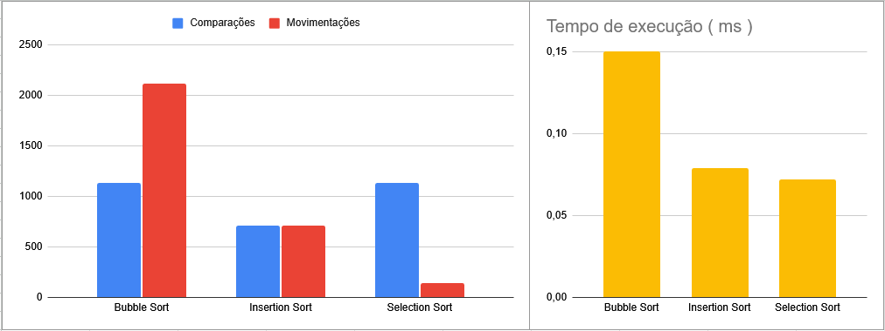

# AEDs II: Complexidade e métodos de ordenação
Atividade prática da disciplina de AEDs II com foco na análise de complexidade de algoritmos e implementação de métodos de ordenação.

## Aluno

* Lucas Moraes Rocha Spiazzi

### Resultados obtidos

| Método | Tamanho do Vetor | Comparações | Movimentações | Tempo (ms) |
| :--- | :---: | :---: | :---: | :---: |
| Bubble Sort | 3 | 3 | 6 | 0,007 |
| Insertion Sort | 3 | 2 | 2 | 0,005 |
| Selection Sort | 3 | 3 | 6 | 0,008 |
| Bubble Sort | 6 | 15 | 24 | 0,005 |
| Insertion Sort | 6 | 8 | 8 | 0,004 |
| Selection Sort | 6 | 15 | 15 | 0,005 |
| Bubble Sort | 12 | 66 | 102 | 0,007 |
| Insertion Sort | 12 | 34 | 34 | 0,006 |
| Selection Sort | 12 | 66 | 33 | 0,006 |
| Bubble Sort | 24 | 276 | 351 | 0,051 |
| Insertion Sort | 24 | 117 | 117 | 0,01 |
| Selection Sort | 24 | 276 | 69 | 0,014 |
| Bubble Sort | 48 | 1.128 | 2.118 | 0,08 |
| Insertion Sort | 48 | 706 | 706 | 0,054 |
| Selection Sort | 48 | 1.128 | 141 | 0,039 |

